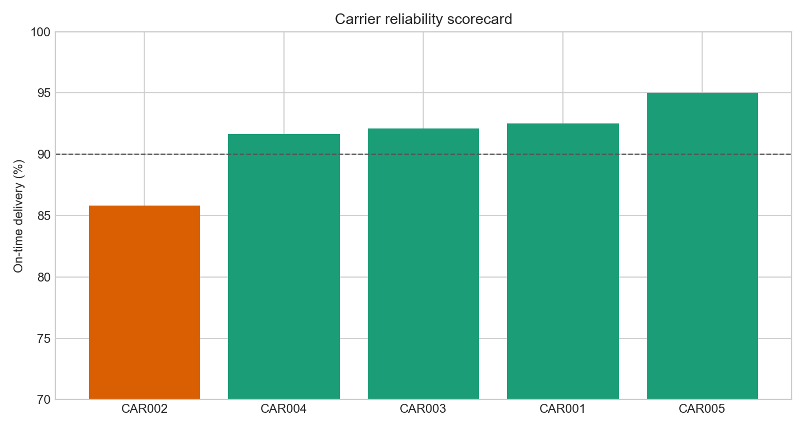
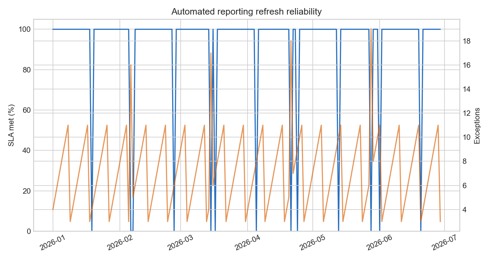

# Connexzia Freight Data Quality Analytics Lab

## Motivation

Freight coordination depends on a dependable daily view of shipments, carrier performance, and report freshness. When ETAs or proof-of-delivery fields are incomplete, or automated reports arrive late, dispatch and customer-facing teams can make decisions from an unreliable operating picture.

## What this project is

This is a reproducible analytics workbench for a freight-coordination operating scenario. It joins shipment, event, carrier, and reporting-run extracts; applies data-quality and refresh controls; and produces concise decision outputs for dispatch leadership.

## Why this problem matters

On-time delivery is a customer-facing service outcome, while linehaul economics and report reliability shape operating decisions. The workbench separates those outcomes from the health of the data that supports them.

## Data or evidence used

The data is synthetic, created to model a plausible dispatch workflow without representing Connexzia internal records. It contains 1,200 shipment records, 4,800 source-system events, 180 scheduled reporting runs, and a carrier reference table. Definitions and assumptions are in [data_dictionary.md](data_dictionary.md).

## How the project works

`scripts/generate_data.py` creates source-style extracts with deterministic randomness. `scripts/analyze.py` calculates carrier scorecards, data-quality exceptions, and reporting SLA performance. SQL controls in `analysis/sql_checks.sql` express the core integrity checks independently of Python.

## Outputs or views



The scorecard surfaces carrier-level on-time delivery variance against a 90% working threshold, supporting a targeted carrier review rather than a blanket intervention.



The refresh view makes late or failed reporting runs and their exception load visible, supporting an owner-and-SLA operating routine.

## What the analysis says

The synthetic scenario demonstrates two distinct management problems: carrier reliability varies enough to justify lane/carrier review, and report-run exceptions cluster with refresh misses. See [executive findings](analysis/executive_findings.md) for the generated-output interpretation.

## Recommendations

1. Establish a daily exception queue for missing ETA and proof-of-delivery fields, owned before the morning reporting cutoff.
2. Review carriers below the 90% on-time threshold by lane before changing broad network policy.
3. Alert on failed or >60-minute report runs; track refresh SLA and exception rate together so a successful-but-low-quality refresh is not treated as healthy.

## Repository structure

```
data/                 source-style synthetic extracts
analysis/             plan, findings, SQL controls, generated outputs
scripts/              deterministic generation and analysis
docs/images/          rendered evidence
```

## How to run or inspect

```bash
python3 -m venv .venv && source .venv/bin/activate
pip install -r requirements.txt
python scripts/generate_data.py
python scripts/analyze.py
```

## Caveats and limitations

This is a learning artifact based on synthetic data. It does not claim internal Connexzia metrics, causal effects, production integrations, or a deployed dashboard. Thresholds are illustrative operating controls and should be calibrated to contracts, lane mix, and service commitments.
